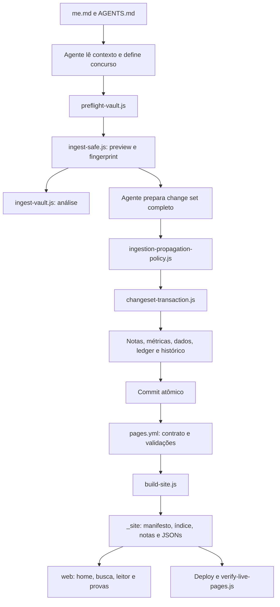

# Mapa de scripts e contratos do sistema

Inventário técnico extraído em **05/10/2026**, com base no commit `7d644624002ea1b316e128b5a81f4e64a9caf1fe` de `leorruas/concursos`. O inventário inicial abrangia os **39 arquivos JavaScript versionados**: 25 em `scripts/`, 13 em `web/` e `script.js`, além do JavaScript embutido em `index.html`, do workflow e dos dados que conectam essas partes. Exclui bibliotecas externas, temas e artefatos gerados. Os links de código ao final apontam para essa versão auditada.

Após a primeira rodada de correções, há **41 arquivos JavaScript** (27 em `scripts/`, 13 em `web/` e `script.js`). O snapshot inicial e seus links permanecem rastreáveis; as mudanças vigentes estão registradas abaixo.

Este mapa descreve **o contrato esperado pela governança**, **o comportamento implementado** e **as lacunas verificadas**. Não substitui [[me]], [[AGENTS]] nem [[.agent/AGENTS]]. Um teste verde prova somente as propriedades que ele verifica.

## Como as partes se conectam

Para alterações multi-arquivo fora da ingestão, `apply-changeset.js` chama diretamente a transação. Pelo GitHub conectado, a operação equivalente é `create_tree → create_commit → update_ref` sem force. Scripts locais não criam commit nem publicam por conta própria.

### Responsabilidade de cada camada

| Camada | Responsabilidade | Evidência necessária |
| --- | --- | --- |
| Governança | Definir concurso, fontes, destino pedagógico, propagação, publicação e escrita | Leitura de `me.md`, dos dois `AGENTS.md` e do contrato aplicável |
| Agente | Interpretar entrada, escolher notas, calcular métricas e preparar todos os conteúdos | Plano revisável e change set completo |
| Ingestão | Analisar entrada, impedir reaplicação da mesma evidência e exigir destinos mínimos | Preview, fingerprint e validação do manifesto |
| Transação | Verificar precondições de todos os arquivos e reverter falha capturada | Hashes SHA-256 e validação pós-escrita |
| Validadores | Rejeitar estados ou diffs que violem os checks implementados | Saída dos scripts e integração contínua (CI) |
| Build | Selecionar conteúdo público e reconstruir derivados | `_site/manifest.json` e `_site/search-index.json` |
| Interface | Carregar, pesquisar, navegar e apresentar dados | Resultado visível no navegador e rota correta |
| Publicação | Servir o artefato e confirmar o catálogo ao vivo | Workflow do HEAD final e comparação do manifesto |

A governança exige separação Dataprev/FGV e Câmara/Cebraspe. O código de propagação ainda não implementa integralmente essa separação; ver lacunas abaixo.

## Contratos dos scripts operacionais

Todos os comandos abaixo partem da raiz do repositório. Os scripts usam módulos JavaScript e bibliotecas nativas do Node.js; não há `package.json` nem instalação de dependências definida no projeto. O workflow declara Node.js 20. Validadores/testes normalmente retornam código 0 no sucesso e 1 na falha; exceções não capturadas também encerram com erro. Bibliotecas retornam objetos ou lançam exceções.

### scripts/preflight-vault.js

**Faz:** prova a saúde inicial do vault. **Entrada:** árvore atual de notas/dados/governança. **Saída:** relatório no terminal; interrompe no primeiro check que falhar. **Escrita:** os testes chamados usam áreas temporárias; nenhuma alteração de conteúdo do vault é pretendida.

**Dependências:** executa, em sequência, `validate-vault-invariants`, `validate-integrity`, `test-ingestion-idempotency`, `test-question-ingestion-policy`, `test-ingestion-propagation-policy` e `test-changeset-transaction`. **Dependências adicionais vigentes:** testa também `test-simulado-propagation.js` e `test-home-without-provas.js`. **Contrato:** executar antes de mudança não corretiva; estado vermelho admite apenas correção relacionada. **Limite:** não verifica busca, build, interface, deploy nem o diff da mudança futura. Uso: `node scripts/preflight-vault.js`.

### scripts/ingest-safe.js

**Faz:** porta canônica de ingestão. **Entrada:** `--input` (padrão `00 inbox/00 ingestão.md`), `--type`, `--concurso` (padrão `dataprev-2026`), `--dry-run` ou `--apply --changeset <arquivo>`. **Saída:** preview, erros clínicos e prefixo do fingerprint no terminal; apply informa arquivos alterados. **Dependências:** motor legado, idempotência, política de propagação e transação.

**Contrato do apply:** manifesto `{version:1, draft:false, ingestionFingerprint, operations:[...]}`, concurso compatível quando declarado, destinos obrigatórios e hashes dos arquivos existentes. Acrescenta as operações reservadas do ledger e da limpeza da inbox canônica; o manifesto do agente não pode declará-las. Valida invariantes e integridade após escrever e reverte o conjunto se falharem. Duplicata permite inspeção em dry-run, bloqueia apply. **Limites:** não cria o conteúdo editorial nem recalcula todos os painéis automaticamente; não executa preflight nem o contrato do diff por conta própria. O preview imprime o fingerprint integral e a orientação pede preparar o change set, sem citar gerador inexistente. Concurso precisa existir em `data/concursos.json`. Simulado exige `sourcePath` no manifesto, identificando seu caderno.

Uso de análise: `node scripts/ingest-safe.js --input "00 inbox/00 ingestão.md" --concurso dataprev-2026 --dry-run`. O apply só ocorre após plano aprovado, conforme [[me]] e [[1 - Planejamento/Contrato transacional de mudancas]].

### scripts/ingest-vault.js

**Faz:** motor interno `IngestionEngine`, utilizado em modo preview pelo wrapper seguro. **Entrada:** Markdown, opções de tipo/concurso e formatos reconhecidos por expressões regulares: data, `Disciplina:`, `Acertos: 8 / 10`, linhas de erro. Tipos forçados aceitos: `teoria`, `bateria_dirigida`, `simulado`, `diagnostico_erro`, `edital`, `legislacao`, `referencia`, `planejamento`, `desempenho`.

**Saída:** `report` com classificação, arquivos lidos, erros clínicos, warnings e pendências; o plano detalhado é impresso. **Contrato:** rejeitar entrada protegida, classificação ambígua, duplicata heurística de sessão e acertos maiores que total. **Limites:** extração não preenche distribuição/acertos por bloco para nota /115; métricas do plano não são copiadas integralmente para o report retornado. Teoria retorna antes de extrair disciplina. `--report` é parseado sem exportação implementada. `--validate` chama integridade. **Apply legado:** escreve histórico e erros, podendo limpar inbox; não realiza toda a propagação anunciada. Governança proíbe seu uso direto com `--apply` em operações normais.

### scripts/ingestion-idempotency.js

**Faz:** normaliza CRLF, espaços finais e bordas do conteúdo; calcula SHA-256 de `{content, concurso}`. **Entrada:** texto/concurso e ledger JSON em array. **Saída pública:** `normalizarConteudoIngestao`, `calcularFingerprintIngestao`, `carregarLedger`, `localizarFingerprint`, `registrarFingerprintAtomico`.

**Contrato:** mesmo texto normalizado e concurso produz mesmo fingerprint, independentemente de nome de arquivo ou tipo; concurso diferente produz outro. Registro duplicado retorna `{added:false, ledger}`. **Escrita:** helper grava arquivo temporário e renomeia; wrapper seguro inclui o ledger na transação conjunta em vez de chamar esse helper. **Limite:** o helper isolado não faz lock entre processos nem transação com outros arquivos. Teste: `test-ingestion-idempotency.js`.

### scripts/ingestion-propagation-policy.js

**Faz:** mapeia disciplina para pasta e exige caminhos no manifesto. **API:** `mapearPastaMateria`, `extrairDisciplinaDaEntrada`, `destinosObrigatoriosIngestao`, `validarManifestoPropagacao`. **Entrada:** classificação, disciplina e `hasErrors`; manifesto com operações. **Saída:** lista de destinos ou exceção enumerando faltantes. Não escreve.

**Mínimos implementados:** sempre `log.md`; bateria exige avanço local, globais, saturação e questões do projeto Dataprev; erros acrescentam log de erros e JSON de recorrência. Simulado exige catálogo, hub de provas, globais, saturação, questões e dashboard Dataprev; erros acrescentam os mesmos destinos. Teoria exige `index.md` e uma nota de matéria que não seja `Avancos.md`.

**Limites:** recebe `concurso` (padrão Dataprev) e `sourcePath`; exige caderno e `data/provas.json` para simulado e bloqueia operações em outro projeto. Não infere todos os avanços locais de simulado; agente ainda precisa incluí-los quando as métricas mudarem. Câmara sem superfícies existentes exige prepará-las ou declarar pendência, sem reutilizar Dataprev. Valida presença de caminho, não suficiência pedagógica, conteúdo novo ou operação apropriada. Outros tipos recebem apenas o mínimo geral. Teste: `test-ingestion-propagation-policy.js`.

### scripts/question-ingestion-policy.js

**Faz:** decide destino pedagógico de uma questão. **Entrada:** objeto com `taxonomia`, `resultado`, `valorCognitivo`, `mecanismoRecorrente`, `conteudoAusente`, `distratorForte`. **Saída:** `{destinos, motivo}` usando `DESTINOS_QUESTAO`. **Contrato:** sempre métricas; conhecimento/confusão podem enriquecer teoria, recorrência gera destino recorrente, conteúdo ausente exige nota nova, acerto de alto valor pode virar candidata comentada. Não grava teoria ou registros.

**Legenda da API:** `K` = conhecimento; `C` = confusão conceitual; `I` = interpretação; `D` = distração. As siglas são entrada desta função; o dado canônico esperado pela governança utiliza nomes semânticos. **Limites:** não interpreta combinações como `K/C`; não valida enumerações rigorosamente; não é chamada pelo motor/wrapper atuais. É uma política disponível e testada, cuja integração editorial depende do agente. CLI opcional recebe JSON como argumento. Teste: `test-question-ingestion-policy.js`.

### scripts/changeset-transaction.js

**Faz:** biblioteca transacional `aplicarChangeSet(rootDir, manifest, {afterApply})`. **Entrada:** versão 1, operações únicas por caminho; `create`, `replace`, `append`, `prepend`, `delete`; conteúdo textual quando aplicável e `expectedSha256` para arquivo existente. **Saída:** `{changed:[caminhos]}` ou exceção. Helpers públicos: `sha256Text`, `fileSha256`, `validarOperacao`.

**Contrato implementado:** valida todas as precondições antes de escrever; `create` exige ausência; protege `2 - Editais/`, referências de Comunicação e `.git/`; `log.md` aceita só append/prepend. Cada escrita usa temporário + rename. Falha capturada de escrita ou `afterApply` restaura snapshots, inclusive removendo arquivos criados. **Limites:** transação lógica com rollback, sem lock global nem garantia de recuperação após queda abrupta do processo. A validação de caminhos/proteções não substitui todas as restrições editoriais de fontes imutáveis. Teste: `test-changeset-transaction.js`.

### scripts/apply-changeset.js

**Faz:** CLI para a transação genérica. **Entrada:** `--file <manifesto.json>`; aceita também `--no-validate`. **Saída:** arquivos aplicados ou mensagem de abort/reversão. **Escrita:** somente operações do manifesto, sob contrato da biblioteca.

**Dependências:** `changeset-transaction.js`; no fluxo normal chama invariantes e integridade em `afterApply`. **Contrato:** alterações dependentes entram juntas, com hashes; usar ingest-safe para ingestão porque este CLI não verifica fingerprint nem destinos pedagógicos. **Limite:** `--no-validate` existe no código, mas elimina os checks pós-escrita e não comprova conclusão; não é o procedimento normal. Não cria commit. Uso: `node scripts/apply-changeset.js --file caminho/change-set.json`.

### scripts/validate-change-contract.js

**Faz:** valida obrigações no diff de commits. **Entrada:** `BASE_SHA` e `HEAD_SHA`; fallback `HEAD^ → HEAD`; usa Git. **Saída:** relatório e status. Não escreve. **Contrato:** nota nova/renomeada em matérias deve estar no índice e alterar índice/hub no mesmo diff; snapshots devem cumprir metadados/seções; mudanças de avanços e novos simulados devem incluir destinos mínimos; alterações de ingestão preservam referências da governança.

**Limites:** fallback sem base emite aviso e tem cobertura reduzida. Worktree não commitado não é o diff validado. Simulados adicionados, renomeados ou modificados são verificados; parcial/rascunho conserva exceção. Concluídos exigem concurso rastreável no frontmatter ou registro, resultado/comparabilidade em provas.json e destinos do concurso no mesmo diff. Avanços locais exigem projeto explicitamente propagado; ausência falha. Não reconstitui todas as métricas textuais. O alcance da descoberta de hub usa o diretório obtido por `parts.slice(0,3)`, o que merece atenção para notas diretamente na pasta da matéria. Executado no CI antes do build.

### scripts/validate-vault-invariants.js

**Faz:** valida estado global: notas indexadas, snapshots, cobertura/exposição de edital, ledger sem fingerprints inválidos/duplicados, referências operacionais dos agentes, presença de scripts obrigatórios, wikilinks com caminho no índice e ausência de workflows temporários. **Entrada:** notas, índice, dados e governança atuais. **Saída:** erros/avisos; falha se houver erros. Não escreve.

**Contrato:** roda no preflight, após transação e CI. **Limite:** verifica checks estruturais específicos; não calcula todas as métricas, não exige todas as notas de planejamento no índice e não prova renderização/publicação. Uso: `node scripts/validate-vault-invariants.js`.

### scripts/validate-integrity.js

**Faz:** audita concursos, metas/fonte oficial, itens/notas/evidências, erros/proveniência, provas/comparabilidade, inexistência de dados sintéticos de questões/revisões, frontmatter e coerência básica de simulados. **Entrada:** quatro JSONs públicos e notas. **Saída:** relatório e status. Não escreve.

**Modo adicional:** `--audit-site` exige build e procura arquivos privados e JSONs fora da allowlist em `_site/`. **Limites:** aceita siglas clínicas legadas além dos nomes semânticos; checagem de datas não exige todos os campos ausentes; não reconstitui composição oficial ou sincronização completa de resultados. Segurança do artefato não torna o repositório privado: este repositório é público. Uso: `node scripts/validate-integrity.js` e, após build, `node scripts/validate-integrity.js --audit-site`.

### scripts/validate-search-governance.js

**Faz:** exige configuração, benchmarks, governança e referência em `.agent/AGENTS.md`; executa configuração em VM (máquina virtual), rejeita colisões entre grupos de aliases, piso Top 1 inválido, menos de 18 benchmarks, consultas duplicadas/incompletas e índice canônico na raiz. **Entrada:** `web/05a-search-config.js`, `scripts/search-benchmarks.json` e documentos. **Saída:** status, sem escrita.

**Contrato:** semântica centralizada e índice derivado só em `_site/`. **Limite:** não comprova que alias é conceitualmente correto nem que busca ranqueia bem; isso exige benchmark e avaliação do agente. Uso: `node scripts/validate-search-governance.js`.

### scripts/build-site.js

**Faz:** reconstrói o artefato estático isolado. **Entrada:** notas, metadados, `index.html`, `style.css`, `script.js`, `web/*.js` e quatro JSONs autorizados. **Saída/escrita:** apaga e recria `_site/`, copia recursos públicos, gera `manifest.json` e `search-index.json`.

**Visibilidade:** aceita Markdown em `3 - Materias/` e `00 - Desempenho/`; exclui bastidores, duplicatas de sincronização e simulados que declarem simultaneamente `status: rascunho` e `parcial: true`. Referências em matérias podem ser públicas. **Contrato:** manifesto e índice representam exatamente os mesmos sourcePaths únicos. Seções H2/H3 recebem anchor normalizado e sufixo para repetição; `Avancos.md` recebe seções vazias. O índice compacta termos e trecho de 220 caracteres.

**Limites:** build não executa todos os validadores; JSON autorizado ausente gera aviso; parsers simplificados de frontmatter/cabeçalhos não equivalem a parsers completos de YAML/Markdown. Alterar cabeçalho pode alterar URL da seção. Não editar derivados manualmente. Uso: `node scripts/build-site.js`.

### scripts/validate-search-index.js

**Faz:** compara manifesto/índice gerados. **Entrada:** `_site/manifest.json`, `_site/search-index.json` e arquivos publicados. **Saída:** relatório, sem escrita. **Contrato:** arrays, sourcePaths únicos, conjunto igual, nenhuma área privada indexada, Markdown correspondente existente e `secoes` em array.

**Limite:** não mede relevância nem testa o DOM (estrutura da página no navegador), e não confirma conteúdo ao vivo. Requer build. Uso: `node scripts/validate-search-index.js`.

### scripts/verify-live-pages.js

**Faz:** compara catálogo local com `manifest.json` servido pelo Pages. **Entrada:** URL pública posicional e `_site/manifest.json`. **Saída:** confirmação ou falha após até seis tentativas, com intervalos de 5 segundos e cache busting. Não escreve. **Dependência:** rede e build correspondente ao commit esperado.

**Contrato implementado:** conjuntos de `sourcePath` iguais, sem faltantes/extras. **Limite importante:** não compara SHA do deploy, bytes de artigos, JSONs, títulos, índice ou renderização. Mesmo catálogo pode passar com conteúdo antigo; combinar resultado com workflow do HEAD final. Fetch não define timeout explícito. Uso: `node scripts/verify-live-pages.js https://leorruas.github.io/concursos/`.

## Contratos dos testes

Os doze arquivos abaixo são executáveis com `node scripts/<nome>`. O contrato de teste é receber fixtures/código ou artefatos, verificar propriedades e falhar quando alguma asserção não passa. Os testes em máquina virtual não substituem avaliação no navegador.

| Arquivo | Entrada e propriedade verificada | Escrita/limpeza e limites | Onde roda |
| --- | --- | --- | --- |
| `scripts/test-changeset-transaction.js` | Biblioteca + arquivos temporários; replace/append/prepend/create, conflito de hash sem escrita parcial, rollback e proibição de replace do histórico | Cria diretório temporário do sistema e limpa em finally; não cobre crash/lock nem todos os caminhos protegidos | Preflight e CI |
| `scripts/test-ingestion-idempotency.js` | Normalização, conteúdo/concurso, ledger; equivalência textual, distinção substantiva, duplicata bloqueada e outro concurso | Ledger temporário e limpeza em finally; não testa concorrência entre processos nem fluxo completo do wrapper | Preflight e CI |
| `scripts/test-ingestion-propagation-policy.js` | Contextos e manifestos sintéticos; mapeamento, destinos de bateria/simulado/teoria, bloqueio de parcial e separação de projetos, inclusive Câmara | Sem escrita; hashes fictícios são suficientes porque o teste verifica presença, não transação | Preflight e CI |
| `scripts/test-question-ingestion-policy.js` | Questões sintéticas e conjuntos esperados de destinos; conhecimento, confusão, interpretação, distração, acerto valioso e conteúdo ausente | Sem escrita; política isolada, sem integração com ingestão | Preflight e CI |
| `scripts/test-ingest.js` | Motor legado; classificação, erros, duplicata histórica, fonte protegida, ambiguidade, dry-run e rollback induzido | Cria `scripts/.test-tmp`, faz escrita temporária em `log.md` no caso de rollback e limpa; executar em checkout isolado. Caso /115 usa `assert(..., true)` e não prova o cálculo | Fora do preflight/CI atuais |
| `scripts/test-simulado-propagation.js` | Função real do validador em VM: inclusão/alteração/conclusão, exceção parcial, JSON no diff com registro, hub e concurso Câmara | Sem escrita; testa contrato de propagação, não toda a CLI Git | Preflight e CI |
| `scripts/test-home-without-provas.js` | Home real em DOM mínimo: ausência de painel de provas ao iniciar e alternar concursos; cálculo preservado | Sem escrita; teste de integração sintética, complementado por inspeção no navegador | Preflight e CI |
| `scripts/test-search-index.js` | Índice gerado + benchmarks; artigo, título da seção, anchor válido, termos preservados e anchors não duplicados | Sem escrita; mede presença lexical no corpus, não ranking | CI, após build |
| `scripts/test-search-routing.js` | `web/00-route-utils.js` + regressão textual de `web/04-markdown.js`; categoria/título/seção, rotas antigas, disciplina, home e preservação de seção em wikilink | Sem escrita; valida contrato de deep link e clique, mas não executa DOM/scroll em navegador real | CI |
| `scripts/test-hub-ordering.js` | Helpers de `02-data-home` em VM + inspeção de `02a-lazy-data`; hub no topo, tipo e await da rota inicial | Sem escrita; usa recorte do código e checks textuais; não testa UI completa | CI |
| `scripts/test-math-rendering.js` | Helpers de `04-markdown` em VM; proteção/restauração, fórmula e código preservados | Sem escrita; asserção aceita delimitador de um dólar e não prova KaTeX visual em modo display | CI |
| `scripts/test-search-ranking.js` | Manifesto/índice/dados/benchmarks + config, motor e dois adaptadores em VM; score diagnóstico coerente, Top 3 e seção correta em todos os casos; piso Top 1 da configuração (72% nesta versão) | Sem escrita; contexto fixo Dataprev, sem navegador; não cobre toda consulta possível | CI, após build |

`scripts/search-benchmarks.json` é dado canônico de teste, não script: array de `{query, expectedPath, expectedSection}`. Falha semântica deve primeiro virar caso reproduzível, conforme [[1 - Planejamento/Governanca da busca]].

## Contratos dos módulos da interface

São scripts clássicos compartilhando funções/variáveis globais. Não são módulos JavaScript isolados: a ordem em `index.html` faz parte do contrato. O Node.js não deve executá-los como aplicação de navegador; testes carregam helpers específicos.

| Arquivo | O que faz e entradas | Saídas/efeitos e dependências | Contrato e limites |
| --- | --- | --- | --- |
| `web/00-route-utils.js` | Constrói/parseia hash com categoria, título físico e seção | Expõe `construirRotaArtigo` e `parsearHashVault` em window/globalThis | Home, disciplina, artigo e `?secao=`; tolera decode inválido e preserva rotas sem seção. Teste de routing |
| `web/01-core.js` | Lista pelo manifesto; fallback na árvore GitHub; define estado, seletores do DOM, categorias, tema e concurso ativo | `todosOsArtigos`, pastas, artigo atual, funções de título/rota; localStorage `tema-concursos` e `concurso_ativo_id` | Depende do HTML e route-utils. Fallback não aplica exatamente a regra do build, especialmente rascunhos parciais; não usar fallback como prova de publicação |
| `web/02-data-home.js` | Carrega JSONs estratégicos, ordena hubs/artigos, monta home e índice de disciplina; contém carregamento inicial pesado | Atualiza arrays, cards e painel; clique persiste concurso ativo | Função pesada é substituída pelo módulo lazy. Renderizador atual cria seletor/contagem de dias, sem `.concurso-regua-indicadores`. Hubs explícitos ou nome legado primeiro |
| `web/02a-lazy-data.js` | Carrega manifesto, índice compacto e camada estratégica em paralelo | Substitui `carregarTodosOsArtigos`; artigos com `conteudoCompleto:false`, índice por sourcePath e path público; aguarda rota inicial | Deve carregar depois de 02 e antes de init. Falha no índice permite metadados básicos; não baixa todos os corpos para iniciar. Teste de hubs |
| `web/03-article-navigation.js` | Recebe artigo/seção, busca corpo sob demanda e limpa frontmatter/H1 duplicado | Leitor, breadcrumbs, histórico, anterior/próximo, cache de corpo, renderização Markdown/matemática/diagramas e scroll para seção | Depende de globais core e helpers de markdown/busca; evita renderizar fetch antigo se outro artigo foi aberto. Requer path e bibliotecas. Não prova sozinho que todos os wikilinks têm destino exato |
| `web/04-markdown.js` | Processa matemática, callouts, comentários, blocos copiáveis, wikilinks e sumário H2/H3 | Altera HTML, listeners, clipboard e IntersectionObserver; ids do sumário seguem seções indexadas por posição; wikilinks com `#Subtítulo` preservam a seção na rota e no clique | Depende de leitor/estado e rotas. Wikilinks ainda resolvem a nota por basename; seção tenta casar o heading indexado e usa slug normalizado como fallback. Restauração matemática usa um dólar apesar de nó `math-display` |
| `web/05-mermaid.js` | Recebe nós `.mermaid` e tema atual | Inicializa biblioteca Mermaid e renderiza, preservando fonte em dataset para troca de tema | Sem biblioteca retorna; erro de render é logado. Depende de core/leitor e biblioteca externa; geração dos nós deve estar compatível |
| `web/05a-search-config.js` | Define `CONFIG_BUSCA_VAULT`: aliases, pesos de seção e piso Top 1 | Configuração global consumida pelo motor/adaptadores/validador | Fonte canônica de parâmetros deliberados; sem edição automática por cliques. Pesos base do motor ainda estão no código de 06 |
| `web/06-search.js` | Normaliza consulta, filtra stopwords, aliases/fuzzy matching, cria entradas e pontua artigo com contexto de edital/erro | Índice em memória, resultados até 60, trecho/seção, rota e debug `?debugBusca=1` | Depende de config, dados e core. Exclui Avancos pelo papel; favorece contexto do concurso ativo sem limitar biblioteca a um concurso. Funções são substituídas por 06a/06b |
| `web/06a-search-index.js` | Adapta funções de 06 ao índice compacto estruturado e mantém fallback | Sobrescreve tipo/papel/criação/score; termos únicos das seções, desativa bônus de proximidade para compacto; penaliza referência no score de artigo | Exige 06 carregado primeiro; trechos compactos não preservam todas as posições/frases do corpo |
| `web/06b-section-ranking.js` | Ranqueia melhor seção e combina com score contextual de artigo | Substitui score/seção; `detalharPontuacaoEntradaBusca` retorna total, componentes e seção | Exige 06a; nesta config total = seção × 0,82 + artigo × 0,38, arredondado. Penalização de referência aplicada ao componente artigo não representa necessariamente todo o componente seção. Teste de ranking |
| `web/08-provas.js` | Mantém helpers de ordenação, comparabilidade, links e descrição/notas de provas | Helpers disponíveis, sem carregar JSON ou alterar a home | Deve carregar antes do init. Por solicitação do usuário, a home não exibe desempenho em provas; removidos fetch, observer e montagem desse painel. Helpers de cálculo/descrição permanecem disponíveis sem efeitos de montagem. Trata Dataprev e TCDF explicitamente; Câmara cai em descrição genérica |
| `web/07-router-init.js` | Liga busca/voltar/scroll/popstate, interpreta hash e inicia carregamento | Eventos, navegação e finalização do loader mesmo em erro | Carrega por último, após 08. Depende de todas as funções anteriores; carregar antes dos adaptadores pode iniciar comportamento errado |
| `script.js` | Arquivo de compatibilidade com comentário sobre divisão do leitor | Nenhuma função nem efeito executável nesta versão | Copiado pelo build, mas não referenciado como script no HTML; lógica real está em web/ |

### Ordem de carregamento obrigatória

`00-route-utils → 01-core → 02-data-home → 02a-lazy-data → 03-article-navigation → 04-markdown → 05-mermaid → 05a-search-config → 06-search → 06a-search-index → 06b-section-ranking → 08-provas → 07-router-init`.

A numeração dos nomes não basta: `08-provas.js` vem antes de `07-router-init.js` no HTML. As bibliotecas externas carregadas são Marked, Mermaid e KaTeX/auto-render. Marked e Mermaid usam URLs sem versão fixa; disponibilidade e mudanças externas podem afetar a interface sem alteração dos scripts locais.

### JavaScript embutido em index.html

**Entrada:** tema salvo, preferência do sistema e estado da raiz/DOM. **Faz:** aplica tema antecipadamente, mostra loader inicial/transição e publica `CONCURSOS_FINALIZAR_CARREGAMENTO`, `CONCURSOS_MOSTRAR_TRANSICAO` e `CONCURSOS_FINALIZAR_TRANSICAO`. **Efeitos:** classes, elementos e timers, incluindo fallback de 10 segundos. **Consumidores:** core, article-navigation e router-init. O loader desaparecer por timeout não prova que dados/renderização concluíram corretamente.

## Contratos dos arquivos que passam entre scripts

| Artefato | Quem produz/mantém | Consumidores e campos essenciais | Garantia/limite |
| --- | --- | --- | --- |
| Notas Markdown | Agente, com frontmatter, teoria e proveniência | Invariantes, build, leitor; título físico identifica rota, `title` identifica apresentação | Nota nova de matéria exige nota + hub quando existir + índice no mesmo commit |
| Change set JSON | Agente após preview | Wrapper ou CLI → transação; `version`, operações/caminhos, hashes/conteúdo; ingestão também draft/fingerprint | Não confundir lista de destinos com conteúdo realmente sincronizado |
| `data/ingestoes-processadas.json` | Wrapper seguro na transação | Idempotência/invariantes; fingerprint, input, concurso, classificação, processedAt | Ledger operacional, excluído de `_site/data`; não apagar para contornar duplicata |
| `data/concursos.json` | Registro com fontes de concurso/metas | Integridade, home, busca, provas; id, banca, cargo, data, sourcePath, estruturaProva, metasCandidato | Separar fato de edital e meta pessoal |
| `data/edital-itens.json` | Mapeamento de cobertura/evidência | Invariantes, integridade, busca; id/concursoId, notaPath, coberturaNota, exposicaoEstudo, evidência | Cobertura integral/parcial/ausente não equivale automaticamente a domínio mensurado |
| `data/erros-recorrentes.json` | Diagnóstico baseado em evidência | Integridade e ranking; id, concursoId, disciplina, assunto, tipoErro, notaPath, sourcePath | Dado esperado é semântico; validador aceita siglas legadas |
| `data/provas.json` | Registro de provas/simulados | Integridade e 08-provas; id, concursoId, sourcePath, resultado, comparabilidadeEdital | Markdown do simulado sozinho não cria entrada no painel; nota depende de comparabilidade/composição |
| `_site/manifest.json` | Build | Core/lazy, validadores, testes e verificação ao vivo; titulo, tituloExibicao, sourcePath, path codificado, categoria | Catálogo derivado, não editar manualmente |
| `_site/search-index.json` | Build | Lazy/adaptadores/sumário/testes; sourcePath, tipo, secoes com titulo/nivel/anchor/trecho/termos | Compacto, não preserva corpo completo nem todas as distâncias lexicais |
| `log.md` | Agente via append/prepend com leitura/hash integral | Histórico humano e transação | Acumulativo; preservar bytes anteriores |

## Contrato de integração e publicação

`.github/workflows/pages.yml` roda em push para `main` ou disparo manual; checkout com profundidade 2, Node.js 20 e concorrência que cancela execuções anteriores. Sequência:

1. Validar contrato do diff com `BASE_SHA`/`HEAD_SHA`.
2. Testar idempotência, destino pedagógico, propagação e transação.
3. Validar invariantes, integridade e governança da busca.
4. Gerar `_site` e validar índice, recall, rotas, hubs, matemática e ranking.
5. Auditar `_site`, configurar Pages e enviar somente `_site` como artefato.
6. Tentar deploy; se falhar, aguardar 15 segundos e tentar uma segunda vez; exigir sucesso de ao menos uma tentativa.
7. Confirmar catálogo ao vivo com `verify-live-pages.js`.

**Contrato:** acompanhar a execução do HEAD final; commit intermediário/cancelado não é conclusão. Build local verde comprova artefato local. Workflow verde + catálogo confirmam as etapas automatizadas; funcionamento visual e atualização dos bytes de uma página exigem evidência adicional quando relevantes.

## Lacunas verificadas entre governança e implementação

As linhas abaixo preservam o diagnóstico do snapshot inicial; consultar o estado de correção a seguir para distinguir lacunas resolvidas e limites restantes. Prioridade deriva do impacto no contrato, não de incidente reproduzido em produção.

| Prioridade | Evidência no código | Consequência | Correção e prova recomendadas |
| --- | --- | --- | --- |
| Alta | Propagação e destinos do motor/validador fixam `dataprev-2026`, mesmo com opção `--concurso` | Flag de concurso não garante separação dos projetos | Parametrizar destinos por concurso; teste que rejeite qualquer propagação Câmara → Dataprev e preserve fluxo Dataprev |
| Alta | Política de simulado não exige `data/provas.json` nem caderno específico; contrato do diff cobre simulados novos, não todas as conclusões/edições | É possível cumprir checks mínimos e deixar painel/catálogos incompletos | Unificar conjunto obrigatório e detectar transição parcial → concluído; testar fonte + JSON + hubs + métricas no mesmo conjunto |
| Alta | `08-provas` retorna sem `.concurso-regua-indicadores`, que `02-data-home` não cria | Registro correto em provas.json pode não aparecer na home | Ajustar ponto de inserção e reproduzir painel renderizado; esta relação foi verificada estaticamente, sem teste de navegador |
| Média | `processarWikilinks` ainda resolve a nota por basename | Colisão entre notas homônimas pode escolher artigo errado, embora `#Subtítulo` agora seja preservado | Evoluir resolução para sourcePath exato e testar colisão de basename |
| Média | `ingest-safe` indica `generate-ingestion-changeset.js` inexistente e imprime somente prefixo do fingerprint | Caminho sugerido para apply não pode ser seguido como documentado | Corrigir instrução/output; permitir obter fingerprint integral e plano revisável, sem inventar gerador disponível |
| Média | Motor não extrai distribuição/acertos por bloco e não integra `classificarDestinoQuestao` | Preview não automatiza nota oficial nem destino de cada questão | Integrar schema/extração e política; testar distribuição válida/inválida, valores semânticos e destinos; agente continua responsável até isso existir |
| Média | `test-ingest` fora do CI; caso da nota usa asserção constante; checks atuais não cobrem painel em DOM | Verde não detecta todas as lacunas observadas | Fortalecer propriedades sem enfraquecer régua; testar wrapper/integração/UI e fixtures isoladas |
| Média | Verificação ao vivo compara só conjuntos de caminhos | Alteração de conteúdo com catálogo igual pode passar sem provar atualização dos bytes | Combinar workflow do HEAD com verificação de conteúdo/build id quando necessário |
| Média | Hashes são conferidos antes da escrita sem lock; helper isolado do ledger faz read-modify-write | Concorrência durante aplicação/crash não têm a mesma garantia de uma transação de banco | Definir lock/journal ou mecanismo equivalente e testes de disputa/recuperação, se esse cenário ocorrer |
| Média | Fallback GitHub do core não reproduz exclusão por frontmatter de rascunhos parciais | Lista de fallback diverge do contrato público do build | Preservar manifesto como fonte pública e testar fallback com rascunho; não anunciar publicação com base na árvore GitHub |
| Média | Restauração de blocos matemáticos insere `$...$`; teste aceita um dólar | Classe display não comprova KaTeX em modo display | Verificar renderização visual e modo matemático apropriado; teste que diferencie display/inline |
| Baixa | API pedagógica recebe siglas; integridade aceita siglas; `me.md` exige valores semânticos | Compatibilidade legado pode esconder desvio do schema esperado | Normalização explícita sem apagar proveniência, teste de serialização e migração revisável |

Também há diferenças entre listas de proteção do motor e da transação e instruções antigas de `me.md` que mostram apply sem changeset. A regra operacional detalhada de `.agent/AGENTS.md` e o contrato transacional exigem changeset. Não interpretar um comando antigo ou limite de validador como autorização para contornar regra textual.

## Primeira rodada de correções — 05/10/2026

- **Separação de projetos corrigida no wrapper, preview e política:** concurso explícito determina destinos; outro projeto no change set é rejeitado. A CLI segura valida o cadastro do concurso. Política/motor compartilham mapeamento de matérias.
- **Propagação de simulados reforçada:** manifesto exige `sourcePath` do caderno e `data/provas.json`; destinos obrigatórios não podem ser apagados. CI cobre criação e alteração, inclusive conclusão de rascunho, exige resultado/comparabilidade rastreáveis e hub de provas. A derivação e conferência de todas as métricas locais permanece responsabilidade do agente.
- **Painel retirado da home por solicitação explícita do usuário:** foram removidos montagem, observer e carregamento de provas nessa superfície. Dados, páginas de desempenho e helpers de cálculo são preservados. Teste garante ausência do painel mesmo ao alternar concursos. A falha do seletor do painel deixa de ser aplicável à home vigente.
- **Orientação de apply corrigida:** fingerprint integral disponível; removida referência ao gerador inexistente. Exemplo de cabeçalho para manifesto de simulado: `{version:1, draft:false, concurso:"dataprev-2026", sourcePath:"00 - Desempenho/Simulados/Simulado-XX.md", ingestionFingerprint:"<hash integral>", operations:[...]}`. Fonte de entrada e destino do caderno podem ser diferentes.
- **Regressões protegidas:** dois novos testes entram em preflight e CI. Testes de política adicionam rejeição de mistura de projetos e ausência de caderno/JSON.

**Ainda pendente:** integração pedagógica por questão, cálculo/extração completa, avanços locais do simulado inferidos automaticamente, criação das superfícies ausentes da Câmara, links ancorados, display matemático, fallback público, verificação de bytes ao vivo e garantias de concorrência/crash. Esta rodada não altera registros históricos de desempenho nem normas editoriais.

## Roteiro para resolver problemas entre as partes

### Protocolo de diagnóstico

1. **Fixar a evidência:** sintoma, concurso, fonte, consulta/rota e commit; distinguir fato observado, inferência estática e hipótese.
2. **Ler regra aplicável:** identidade/agentes, contrato transacional/publicação e governança específica. Conferir saúde do estado-base.
3. **Localizar a primeira divergência:** fonte → registro → transação → diff → build → manifesto/índice → deploy → cliente. Inspecionar produtor e consumidor do mesmo dado.
4. **Reproduzir:** menor caso que falhe; busca usa benchmark antes de ajuste. Confirmar se o problema está no código, fixture ou expectativa.
5. **Corrigir a origem:** sincronizar superfícies dependentes no mesmo conjunto; manter fontes brutas, histórico, proveniência e separação de concursos. Não editar derivados para mascarar causa.
6. **Verificar a propriedade:** executar script alterado diretamente, testes pertinentes e validadores; teste deve falhar antes e passar depois quando houver correção funcional.
7. **Fechar com evidência:** commit atômico, workflow final e publicação quando aplicável; explicar o que mudou, causa, verificações e limitação restante.

### Sintoma → caminho de investigação

| Sintoma | Inspecionar nesta ordem | Critério de correção |
| --- | --- | --- |
| Nota existe no GitHub e não aparece | Visibilidade no build → manifesto local → workflow final → manifesto ao vivo → categoria/lazy/rota | sourcePath publicado e artigo abre no lugar correto |
| Simulado não entra no painel | Caderno/status → provas.json/comparabilidade → catálogo/hub/dashboard → JSON publicado → selector/render de 08 | Registro completo do concurso e painel visível, não só Markdown criado |
| Métrica duplicada | Fingerprint/ledger → evidência original → heurística de duplicatas → manifesto → fontes dos totais | Mesma evidência contada uma vez, sem apagar ledger |
| Change set incompleto | Classificação/concurso → destinos de política → requisitos textuais adicionais → operações/conteúdo | Todas as superfícies corretas presentes e sincronizadas |
| Conflito de hash | Versão lida → hash atual → mudanças concorrentes | Releitura/rebase de plano, sem force/sobrescrita cega |
| Busca retorna artigo errado | Benchmark → texto/aliases → índice → papel/contexto → 06a → 06b → Top 1/Top 3/seção | Caso reproduzido e régua global preservada |
| Clique abre seção errada | sourcePath → heading → anchor do build → rota → sumário → wikilink | Mesmo destino do diagnóstico e seção efetivamente renderizada |
| Fórmula/diagrama quebra | Texto fonte → proteção → Marked → restauração/KaTeX ou nó Mermaid → biblioteca/tema | Expressão íntegra e renderização visual esperada |
| CI falha com preflight verde | Primeira etapa que falhou → escopo adicional do CI → diff real → fixture/código | Corrigir causa da etapa e executar script isolado antes do commit |

### Verificações por tipo de intervenção

| Intervenção | Verificação mínima pertinente |
| --- | --- |
| Documento operacional/índice/referência dos agentes | Preflight inicial; invariantes + integridade após aplicação; contrato do diff do commit final e workflow |
| Ingestão/transação | Tests de políticas/idempotência/transação afetados; wrapper em fixture isolada quando alterado; invariantes/integridade e diff |
| Busca/anchors | Governança; build; índice, recall, routing e ranking; navegação real quando comportamento visual mudar |
| Leitor/home/painel | Build e testes relacionados; verificação no navegador do sintoma, além do catálogo |
| Visibilidade/publicação | Build; índice; audit-site; workflow e catálogo ao vivo; conteúdo esperado quando catálogo sozinho não distinguir versões |

## Manutenção do mapa

Ao trabalhar neste sistema, usar este documento como índice de diagnóstico e conferir o código vigente antes de agir. Se um script mudar, atualizar sua entrada, contrato, dependências, teste e lacunas resolvidas no mesmo trabalho. Ao criar script permanente, incluí-lo no inventário; scripts temporários devem ser removidos após uso, conforme governança existente.

O mapa preserva conhecimento operacional para próximas sessões. A capacidade de resolver problemas vem de investigar a relação entre produtor, consumidor e regra com evidência; a documentação não substitui execução nem garante competência por si só.

## Fontes e código auditado

**Governança:** [[me]], [[AGENTS]], [[.agent/AGENTS]], [[index]], [[1 - Planejamento/Contrato transacional de mudancas]], [[1 - Planejamento/Contrato de publicacao GitHub Pages]], [[1 - Planejamento/Regras de ingestao de questoes]], [[1 - Planejamento/Governanca da busca]].

- [.github/workflows/pages.yml](https://github.com/leorruas/concursos/blob/7d644624002ea1b316e128b5a81f4e64a9caf1fe/.github/workflows/pages.yml#L1)
- [index.html](https://github.com/leorruas/concursos/blob/7d644624002ea1b316e128b5a81f4e64a9caf1fe/index.html#L1)
- [script.js](https://github.com/leorruas/concursos/blob/7d644624002ea1b316e128b5a81f4e64a9caf1fe/script.js#L1)
- [scripts/apply-changeset.js](https://github.com/leorruas/concursos/blob/7d644624002ea1b316e128b5a81f4e64a9caf1fe/scripts/apply-changeset.js#L1)
- [scripts/build-site.js](https://github.com/leorruas/concursos/blob/7d644624002ea1b316e128b5a81f4e64a9caf1fe/scripts/build-site.js#L1)
- [scripts/changeset-transaction.js](https://github.com/leorruas/concursos/blob/7d644624002ea1b316e128b5a81f4e64a9caf1fe/scripts/changeset-transaction.js#L1)
- [scripts/ingest-safe.js](https://github.com/leorruas/concursos/blob/7d644624002ea1b316e128b5a81f4e64a9caf1fe/scripts/ingest-safe.js#L1)
- [scripts/ingest-vault.js](https://github.com/leorruas/concursos/blob/7d644624002ea1b316e128b5a81f4e64a9caf1fe/scripts/ingest-vault.js#L1)
- [scripts/ingestion-idempotency.js](https://github.com/leorruas/concursos/blob/7d644624002ea1b316e128b5a81f4e64a9caf1fe/scripts/ingestion-idempotency.js#L1)
- [scripts/ingestion-propagation-policy.js](https://github.com/leorruas/concursos/blob/7d644624002ea1b316e128b5a81f4e64a9caf1fe/scripts/ingestion-propagation-policy.js#L1)
- [scripts/preflight-vault.js](https://github.com/leorruas/concursos/blob/7d644624002ea1b316e128b5a81f4e64a9caf1fe/scripts/preflight-vault.js#L1)
- [scripts/question-ingestion-policy.js](https://github.com/leorruas/concursos/blob/7d644624002ea1b316e128b5a81f4e64a9caf1fe/scripts/question-ingestion-policy.js#L1)
- [scripts/test-changeset-transaction.js](https://github.com/leorruas/concursos/blob/7d644624002ea1b316e128b5a81f4e64a9caf1fe/scripts/test-changeset-transaction.js#L1)
- [scripts/test-hub-ordering.js](https://github.com/leorruas/concursos/blob/7d644624002ea1b316e128b5a81f4e64a9caf1fe/scripts/test-hub-ordering.js#L1)
- [scripts/test-ingest.js](https://github.com/leorruas/concursos/blob/7d644624002ea1b316e128b5a81f4e64a9caf1fe/scripts/test-ingest.js#L1)
- [scripts/test-ingestion-idempotency.js](https://github.com/leorruas/concursos/blob/7d644624002ea1b316e128b5a81f4e64a9caf1fe/scripts/test-ingestion-idempotency.js#L1)
- [scripts/test-ingestion-propagation-policy.js](https://github.com/leorruas/concursos/blob/7d644624002ea1b316e128b5a81f4e64a9caf1fe/scripts/test-ingestion-propagation-policy.js#L1)
- [scripts/test-math-rendering.js](https://github.com/leorruas/concursos/blob/7d644624002ea1b316e128b5a81f4e64a9caf1fe/scripts/test-math-rendering.js#L1)
- [scripts/test-question-ingestion-policy.js](https://github.com/leorruas/concursos/blob/7d644624002ea1b316e128b5a81f4e64a9caf1fe/scripts/test-question-ingestion-policy.js#L1)
- [scripts/test-search-index.js](https://github.com/leorruas/concursos/blob/7d644624002ea1b316e128b5a81f4e64a9caf1fe/scripts/test-search-index.js#L1)
- [scripts/test-search-ranking.js](https://github.com/leorruas/concursos/blob/7d644624002ea1b316e128b5a81f4e64a9caf1fe/scripts/test-search-ranking.js#L1)
- [scripts/test-search-routing.js](https://github.com/leorruas/concursos/blob/7d644624002ea1b316e128b5a81f4e64a9caf1fe/scripts/test-search-routing.js#L1)
- [scripts/validate-change-contract.js](https://github.com/leorruas/concursos/blob/7d644624002ea1b316e128b5a81f4e64a9caf1fe/scripts/validate-change-contract.js#L1)
- [scripts/validate-integrity.js](https://github.com/leorruas/concursos/blob/7d644624002ea1b316e128b5a81f4e64a9caf1fe/scripts/validate-integrity.js#L1)
- [scripts/validate-search-governance.js](https://github.com/leorruas/concursos/blob/7d644624002ea1b316e128b5a81f4e64a9caf1fe/scripts/validate-search-governance.js#L1)
- [scripts/validate-search-index.js](https://github.com/leorruas/concursos/blob/7d644624002ea1b316e128b5a81f4e64a9caf1fe/scripts/validate-search-index.js#L1)
- [scripts/validate-vault-invariants.js](https://github.com/leorruas/concursos/blob/7d644624002ea1b316e128b5a81f4e64a9caf1fe/scripts/validate-vault-invariants.js#L1)
- [scripts/verify-live-pages.js](https://github.com/leorruas/concursos/blob/7d644624002ea1b316e128b5a81f4e64a9caf1fe/scripts/verify-live-pages.js#L1)
- [web/00-route-utils.js](https://github.com/leorruas/concursos/blob/7d644624002ea1b316e128b5a81f4e64a9caf1fe/web/00-route-utils.js#L1)
- [web/01-core.js](https://github.com/leorruas/concursos/blob/7d644624002ea1b316e128b5a81f4e64a9caf1fe/web/01-core.js#L1)
- [web/02-data-home.js](https://github.com/leorruas/concursos/blob/7d644624002ea1b316e128b5a81f4e64a9caf1fe/web/02-data-home.js#L1)
- [web/02a-lazy-data.js](https://github.com/leorruas/concursos/blob/7d644624002ea1b316e128b5a81f4e64a9caf1fe/web/02a-lazy-data.js#L1)
- [web/03-article-navigation.js](https://github.com/leorruas/concursos/blob/7d644624002ea1b316e128b5a81f4e64a9caf1fe/web/03-article-navigation.js#L1)
- [web/04-markdown.js](https://github.com/leorruas/concursos/blob/7d644624002ea1b316e128b5a81f4e64a9caf1fe/web/04-markdown.js#L1)
- [web/05-mermaid.js](https://github.com/leorruas/concursos/blob/7d644624002ea1b316e128b5a81f4e64a9caf1fe/web/05-mermaid.js#L1)
- [web/05a-search-config.js](https://github.com/leorruas/concursos/blob/7d644624002ea1b316e128b5a81f4e64a9caf1fe/web/05a-search-config.js#L1)
- [web/06-search.js](https://github.com/leorruas/concursos/blob/7d644624002ea1b316e128b5a81f4e64a9caf1fe/web/06-search.js#L1)
- [web/06a-search-index.js](https://github.com/leorruas/concursos/blob/7d644624002ea1b316e128b5a81f4e64a9caf1fe/web/06a-search-index.js#L1)
- [web/06b-section-ranking.js](https://github.com/leorruas/concursos/blob/7d644624002ea1b316e128b5a81f4e64a9caf1fe/web/06b-section-ranking.js#L1)
- [web/07-router-init.js](https://github.com/leorruas/concursos/blob/7d644624002ea1b316e128b5a81f4e64a9caf1fe/web/07-router-init.js#L1)
- [web/08-provas.js](https://github.com/leorruas/concursos/blob/7d644624002ea1b316e128b5a81f4e64a9caf1fe/web/08-provas.js#L1)

**Validação do estado-base:** preflight aprovado e workflow `Publicar no GitHub Pages` do commit auditado concluído com sucesso (run `37337471511`). As lacunas acima resultam de leitura do código; não foram corrigidas nesta operação de documentação.

- [scripts/test-simulado-propagation.js](https://github.com/leorruas/concursos/blob/main/scripts/test-simulado-propagation.js#L1)
- [scripts/test-home-without-provas.js](https://github.com/leorruas/concursos/blob/main/scripts/test-home-without-provas.js#L1)
