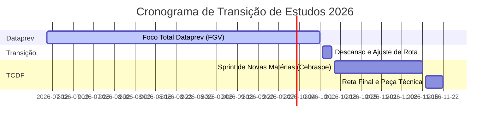

# Roadmap Integrado: Dataprev 2026 & TCDF 2026

Planejamento estratégico de estudos e controle de datas críticas para os concursos da **Dataprev** (banca FGV) e do **TCDF** (banca Cebraspe).

---

## 📅 Datas Críticas e Alertas de Controle

Para não esquecer nenhuma data importante enquanto estuda:

| Concurso | Evento / Ação | Data Limite / Período | Status / Atenção |
| :--- | :--- | :--- | :--- |
| **TCDF** | Solicitação de Isenção da Taxa | **31/07 a 06/08/2026** | **Atenção:** Ocorre durante a preparação para a Dataprev. |
| **Dataprev** | Prazo Final de Inscrição | **06/08/2026 (até 16h)** | Efetuar o pagamento da taxa de R$ 110,00 logo para consolidar. |
| **TCDF** | Período de Inscrições | **26/08 a 17/09/2026** | Fazer logo na abertura para evitar esquecimento. |
| **TCDF** | Pagamento da Taxa de Inscrição | **Até 21/09/2026** | Taxa de R$ 148,00. |
| **Dataprev** | **Aplicação da Prova Objetiva** | **11/10/2026 (13h às 17h)** | Foco de estudos 100% até aqui. |
| **TCDF** | **Aplicação das Provas (Obj e Disc)** | **22/11/2026 (Manhã e Tarde)** | Transição de estudos pós-Dataprev durará exatamente 6 semanas. |

---

## 🗺️ Roadmap de Estudos em Fases

### Fase 1: Foco Total Dataprev (Até 11/10/2026)
- **Objetivo:** Maximizar o desempenho nos conteúdos da FGV.
- **Estratégia:** Focar nos hubs de [[3 - Materias/Portugues/portugues|Língua portuguesa]] (FGV), [[3 - Materias/Logica/00 - logica|Raciocínio lógico]] e nas matérias específicas de [[3 - Materias/Comunicacao/comunicacao|Comunicação social]].
- **Ações Críticas:**
  - Realizar os simulados Dataprev previstos no cronograma.
  - **Ação Paralela:** Solicitar isenção do TCDF entre 31/07 e 06/08, e fazer a inscrição no TCDF em 26/08.

### Fase 2: Descanso e Transição (12/10 a 15/10/2026)
- **Objetivo:** Descompressão pós-prova e virada de chave mental.
- **Ações Críticas:**
  - Descansar nos dias 12 e 13 de outubro.
  - Nos dias 14 e 15 de outubro: Ajustar o cronograma semanal no vault para o estilo **Cebraspe** e organizar o material das novas disciplinas do TCDF.

### Fase 3: Sprint de Matérias Novas - Engenharia Cebraspe (16/10 a 15/11/2026)
- **Objetivo:** Adquirir base nas disciplinas específicas do TCDF e adaptar-se ao modelo Cebraspe (Certo/Errado com fator de correção).
- **Disciplinas Novas (Foco Diário):**
  - **AFO (Administração Financeira e Orçamentária):** O peso mais alto da prova especializada.
  - **Regime Jurídico do DF (LC 840/2011):** Estudo de deveres, direitos e processo disciplinar.
  - **Lei Orgânica do DF (LODF)**.
  - **Lei Orgânica e Regimento Interno do TCDF**.
  - **Outras Noções de Direito:** Previdenciário, Tributário, Civil.
  - **Noções de Primeiros Socorros** e **RIDE/DF**.
- **Manutenção (Resolução de Questões Cebraspe):**
  - Português, Raciocínio Lógico (com Matemática Financeira), Direito Constitucional, Direito Administrativo, Administração Pública e Geral.

### Fase 4: Reta Final e Simulação Discursiva (16/11 a 21/11/2026)
- **Objetivo:** Ajustar o ritmo de prova discursiva e controle de marcação da folha de respostas.
- **Estratégia:**
  - Treinar a redação de **Peça Técnica (Informação - até 50 linhas)** com base em AFO e Direito Administrativo.
  - Resolver 1 simulado completo de 150 itens da banca Cebraspe para definir o limite seguro de questões a deixar em branco.
  - Revisão de "lei seca" (Regimento Interno do TCDF, LODF e LC 840).

---

**Referências:**
- Edital Seco da Dataprev: [[2 - Editais/Dataprev 2026 (Original)\|Dataprev 2026]]
- Edital Seco do TCDF: [[2 - Editais/TCDF 2026 ANACE\|TCDF 2026 ANACE]]
- Cronograma de Estudos Dataprev: [[4 - Projetos/dataprev-2026/Cronograma\|Cronograma Dataprev]]
