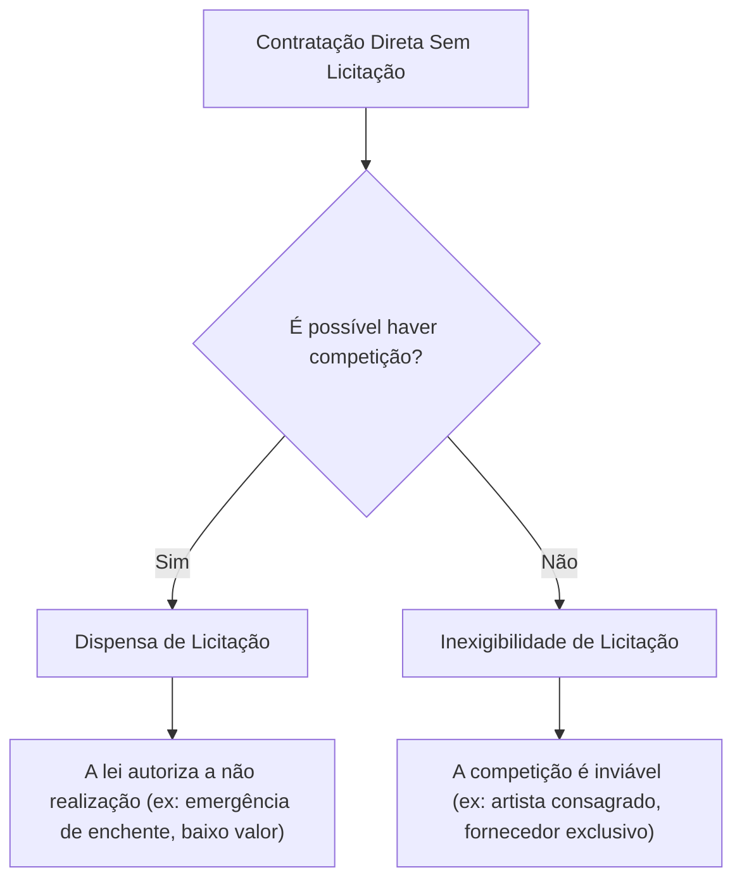

# Licitações e contratos

A licitação é o procedimento administrativo pelo qual a Administração Pública seleciona a proposta mais vantajosa para o contrato de seu interesse, assegurando igualdade de condições a todos os concorrentes.

---

## 1. Finalidades e Princípios

A licitação concretiza princípios como a **impessoalidade**, a **moralidade**, a **publicidade** e a **eficiência** (LIMPE), evitando favorecimentos pessoais e garantindo que o dinheiro público seja usado da melhor maneira possível.

> [!IMPORTANT]
> **Pegadinha Clássica de Prova**:
> 1. A licitação **não busca necessariamente o menor preço**. O objetivo correto é obter a **proposta mais vantajosa** (que pode envolver técnica, qualidade e custo-benefício).
> 2. **Nem toda contratação exige licitação**: a lei estabelece exceções (contratação direta).
> 3. Uma contratação direta sem licitação **não configura automaticamente improbidade administrativa** (exige dolo, má-fé e subsunção a um tipo penal/LIA).

---

## 2. Dispensa × Inexigibilidade de Licitação

Esta é a distinção mais cobrada em exames públicos. Para diferenciá-las, aplique a seguinte pergunta discriminadora:

> **Pergunta-chave**: *É possível haver competição?*

### Dispensa de Licitação
* **Lógica**: A competição existe e é viável (há outras empresas no mercado capazes de realizar o serviço), mas a lei permite ou obriga a contratação direta devido a circunstâncias específicas previstas em lei (ex: situação de emergência ou calamidade pública, pequenas contratações).

### Inexigibilidade de Licitação
* **Lógica**: A competição é faticamente inviável (não há como colocar concorrentes para disputar). O objeto é singular ou o fornecedor é exclusivo.
* **Exemplos clássicos**:
  - Show de artista consagrado pela opinião pública ou crítica especializada (não há concorrência pela identidade específica do artista).
  - Aquisição de materiais ou equipamentos que só possam ser fornecidos por produtor ou representante comercial exclusivo.
  - Serviços técnicos profissionais especializados de natureza predominantemente intelectual com profissionais de notória especialização.

---

## 3. Fases do Procedimento Licitatório (Lei nº 14.133/2021)

A licitação é estruturada como um **procedimento administrativo** (sequência ordenada de atos). Na Nova Lei de Licitações (NLLC), a regra geral inverteu o fluxo clássico, colocando a habilitação após o julgamento:

*   **Fase Preparatória (Planejamento)**: Elaboração de estudos técnicos, definição do objeto, estimativa de custos e elaboração do edital.
*   **Habilitação**: Verificação das condições jurídicas, técnicas, fiscais e econômico-financeiras da empresa vencedora para celebrar o contrato. *Atenção: ocorre em regra após o julgamento.*
*   **Homologação**: Confirmação da regularidade jurídica e procedimental do certame pela autoridade superior.
*   **Adjudicação**: Atribuição formal do objeto licitado ao vencedor (garantia de preferência na contratação).

---

## 4. Princípios Licitatórios Específicos

Além dos princípios constitucionais (LIMPE), a Lei nº 14.133/2021 destaca:

*   **Julgamento Objetivo**: O vencedor deve ser escolhido com base nos critérios previamente descritos no edital, vedada a escolha por preferência ou convicção pessoal do agente público.
*   **Competitividade**: Proibição de cláusulas que restrinjam indevidamente a participação de interessados (ex: exigir sede municipal sem justificativa técnica).
*   **Segregação de Funções**: Divisão de atribuições para evitar que o mesmo servidor execute e controle etapas propensas a conflitos de interesse (ex: quem elabora o edital não deve aprovar os pagamentos).
*   **Planejamento**: Racionalização das contratações para garantir alinhamento com a finalidade pública e eficiência orçamentária.
*   **Transparência**: Ampla acessibilidade aos atos do certame, assegurando o controle social.

---

## 5. Critérios de Julgamento de Propostas

Formas objetivas pelas quais a Administração define a proposta vencedora:

1.  **Menor preço**: Critério clássico em que o menor custo vence, contanto que atenda a todas as especificações mínimas do edital (menor preço $\neq$ qualquer qualidade).
2.  **Maior desconto**: Aplicação de percentual de redução sobre um preço máximo ou tabela de referência previamente estabelecida no edital.
3.  **Melhor técnica**: Avaliação focada primariamente na qualidade, metodologia e equipe técnica da proposta (comum para projetos intelectuais ou tecnologia complexa).
4.  **Técnica e preço**: Ponderação balanceada entre a qualidade técnica da proposta e o preço ofertado.

---

**Fontes Brutas:**
- [[00 inbox/12-06-2026|Inbox de 12/06/2026]]
- [[00 inbox/15-06-2026|Inbox de 15/06/2026]]
