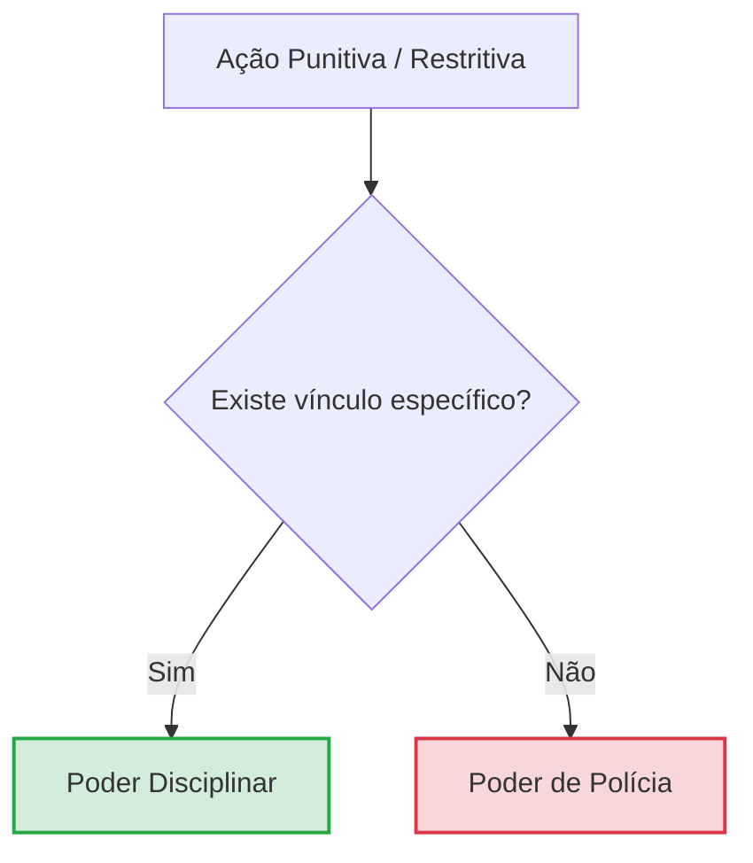

# Poderes administrativos

Instrumentos jurídicos e prerrogativas conferidas por lei aos agentes da Administração Pública para permitir a realização e a supremacia do interesse público.

---

## 1. Natureza jurídica: Poder-dever

Os poderes administrativos não são privilégios ou direitos subjetivos dos agentes públicos, mas sim **poderes-deveres**. A Administração é obrigada a exercê-los sempre que a proteção do interesse público ou o cumprimento da lei exigir sua atuação (indisponibilidade do interesse público).

---

## 2. Poder vinculado vs. Poder discricionário

Maneiras como a lei estabelece a margem de atuação do agente público:

*   **Poder vinculado**: A lei preestabelece todos os requisitos, condições e o único comportamento possível para o agente. Não há margem de escolha ou juízo de valor.
    *   *Exemplo*: Concessão de aposentadoria ou posse de candidato que cumpriu todas as exigências legais.
*   **Poder discricionário**: A lei confere ao administrador público uma margem de escolha fundamentada em critérios de **conveniência e oportunidade** (mérito administrativo).

> [!WARNING]
> **Discricionariedade ≠ Arbitrariedade**
> A discricionariedade é uma liberdade de escolha limitada pela lei e pelos princípios constitucionais. O ato discricionário continua sujeito ao controle de **legalidade, finalidade, razoabilidade, proporcionalidade e motivação**, não existindo ato administrativo totalmente imune a controle.

---

## 3. Poder hierárquico e disciplinar

*   **Poder hierárquico**: Prerrogativa de organizar, estruturar e coordenar internamente os órgãos e agentes da Administração. Dele decorrem as atribuições de distribuir funções, dar ordens, fiscalizar condutas, delegar e avocar competências.
*   **Poder disciplinar**: Prerrogativa de aplicar penalidades e sanções a agentes públicos e a pessoas que possuem um **vínculo jurídico específico** com a Administração Pública.
    *   *Exemplo*: Aplicação de suspensão a servidor público ou multa a empresa privada contratada que descumpriu cláusulas do contrato administrativo.

---

## 4. Poder de polícia

Prerrogativa da Administração de restringir, condicionar ou limitar o exercício de direitos, atividades ou o uso de bens individuais em benefício do interesse público coletivo.

---

## 5. Diferença crucial: Poder disciplinar vs. Poder de polícia

Para não confundir as sanções aplicadas por esses dois poderes em provas, a pergunta decisiva deve ser:

$$\text{Existe vínculo jurídico específico com a Administração Pública?}$$

*   **Poder Disciplinar (Vínculo específico)**: Incide sobre quem está dentro da estrutura ou sob contrato (servidor público, estudante de escola pública, concessionária de serviços, empresa contratada).
*   **Poder de Polícia (Sem vínculo específico / Coletividade)**: Incide sobre qualquer cidadão, bem ou atividade privada (motorista autuado no trânsito, interdição de restaurante por normas sanitárias, fechamento de comércio sem alvará).

---
