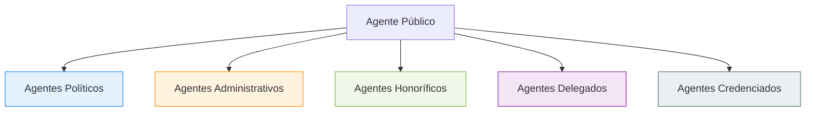

# Agentes públicos

Qualquer pessoa física que exerce, ainda que transitoriamente ou sem remuneração, por eleição, nomeação, designação, contratação ou qualquer outra forma de investidura ou vínculo, mandato, cargo, emprego ou função em entidades da Administração Pública.

---

## 1. Classificação doutrinária dos agentes públicos

A doutrina administrativista subdivide os agentes públicos em essa estrutura:

### A. Agentes Políticos
Formadores da vontade do Estado. Exercem atribuições de direção governamental baseadas diretamente na Constituição. Possuem regime jurídico próprio e não se sujeitam às regras comuns do funcionalismo público.
*   *Exemplos*: Chefes do Poder Executivo (Presidente, Governadores, Prefeitos) e seus auxiliares diretos (Ministros, Secretários), membros do Poder Legislativo (Senadores, Deputados, Vereadores), magistrados e membros do Ministério Público.

### B. Agentes Administrativos
Profissionais contratados para atuar na estrutura interna da Administração Pública. Prestam serviços de natureza profissional e subordinada (relação de emprego ou cargo público). Subdividem-se em três regimes:
*   **Servidores Estatutários (Ocupantes de Cargo Público)**: Sujeitos a um regime estatutário (lei específica da entidade). Vínculo de natureza legal (não contratual). Adquirem estabilidade constitucional após aprovação em concurso público e 3 anos de efetivo exercício.
*   **Empregados Públicos (Ocupantes de Emprego Público)**: Sujeitos ao regime celetista (CLT). Vínculo contratual. Típicos das empresas públicas e sociedades de economia mista. Não adquirem a estabilidade tradicional prevista no art. 41 da CF.
*   **Servidores Temporários (Ocupantes de Função Temporária)**: Contratados temporariamente por tempo determinado para atender a necessidade temporária de excepcional interesse público (art. 37, IX da CF). Vínculo puramente contratual e de direito administrativo, sem necessidade de concurso público (mas exigindo processo seletivo simplificado).

### C. Agentes Honoríficos
Cidadãos convocados pela Administração Pública para prestar serviços públicos específicos e temporários, motivados por dever cívico ou capacidade técnica especial. Normalmente não possuem vínculo empregatício nem remuneração permanente.
*   *Exemplos*: Mesários eleitorais, jurados do Tribunal do Júri, membros de conselhos tutelares.

### D. Agentes Delegados
Particulares que recebem a incumbência de executar determinada atividade ou serviço público, atuando sob fiscalização estatal por sua própria conta e risco.
*   *Exemplos*: Concessionários e permissionários de serviços públicos (ex: empresas de ônibus municipais), tabeliães de cartórios extrajudiciais.

### E. Agentes Credenciados
Pessoas que recebem encargo da Administração para representá-la em determinado ato ou evento específico, normalmente mediante pagamento de remuneração.
*   *Exemplos*: Cientistas, artistas ou técnicos credenciados para representar o país em comissões ou eventos científicos/culturais específicos.

---

## 2. Diferenças cruciais de vínculo e cargos (Gargalos de prova)

### Cargo Efetivo, Cargo em Comissão e Função de Confiança

A Constituição Federal (art. 37, V) estabelece distinções fundamentais quanto ao provimento e a estabilidade dos cargos e funções públicas:

*   **Cargo Efetivo**:
    *   Provido obrigatoriamente por **concurso público**.
    *   Vínculo de caráter permanente.
    *   Gera possibilidade de **estabilidade** (após 3 anos de estágio probatório e demais requisitos constitucionais).
*   **Cargo em Comissão**:
    *   Destinado exclusivamente a atribuições de **direção, chefia e assessoramento**.
    *   De **livre nomeação e exoneração** (a autoridade pode dispensar o ocupante a qualquer momento, sem necessidade de processo ou justificativa complexa).
    *   Pode ser ocupado por pessoas sem concurso público (particular) ou por servidores de carreira (a lei fixará o percentual mínimo destes).
*   **Função de Confiança**:
    *   Também destinada exclusivamente a atribuições de **direção, chefia e assessoramento**.
    *   Exercida **exclusivamente por servidores ocupantes de cargo efetivo** (ou seja, de carreira).

Para diferenciar de forma imediata em provas, a pergunta discriminadora é:

$$\text{A pessoa precisa ser servidora efetiva (de carreira)?}$$

*   **Sim** $\rightarrow$ **Função de Confiança**.
*   **Não** $\rightarrow$ **Cargo em Comissão** (pode ser preenchido por particular sem concurso).

---

> [!IMPORTANT]
> **Estabilidade (Estatutário vs. Celetista)**
> - O **Servidor Estatutário** da Administração Direta, Autárquica e Fundacional goza de estabilidade no serviço público após 3 anos.
> - O **Empregado Público** (CLT) da Administração Indireta exploradora de atividade econômica (ex: Banco do Brasil, Caixa Econômica, Petrobras) **NÃO possui estabilidade**. O STF consolidou que a demissão de empregados de empresas públicas e SEMs exige motivação, mas eles não se equiparam aos servidores estáveis do art. 41.

---

## 3. O Concurso Público e Exceções

A investidura em cargos ou empregos públicos segue regras claras destinadas a assegurar a igualdade e a impessoalidade no acesso às funções estatais:

- **Regra Geral**: A aprovação prévia em **concurso público** (de provas ou de provas e títulos) é requisito obrigatório para a investidura em cargos de provimento efetivo e empregos públicos.
- **Finalidade**: Garantir a igualdade de acesso, a impessoalidade administrativa e a seleção de profissionais com base em critérios estritamente objetivos de mérito.
- **Exceção Constitucional**: A principal exceção à regra geral do concurso são os **cargos em comissão**, declarados em lei de livre nomeação e exoneração, destinados exclusivamente às atribuições de direção, chefia e assessoramento.
- **Exploração em Bancas**: As bancas examinadoras exploram exaustivamente a fronteira entre a regra (concurso público) e a exceção (cargos em comissão). Elas costumam tentar desviar a natureza do cargo em comissão, afirmando que este serviria para "qualquer atividade administrativa" ou que seria a "forma ordinária" de ingresso, o que torna a afirmativa incorreta.

---
