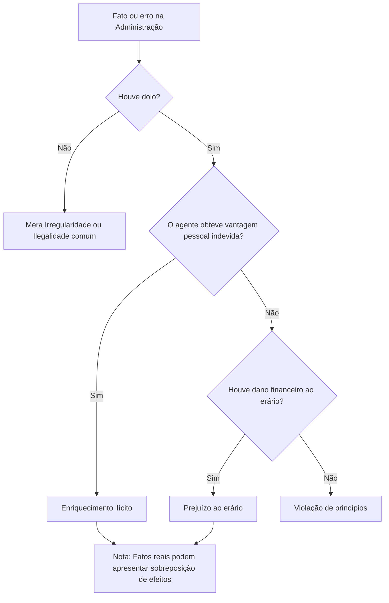

# Improbidade administrativa

A improbidade administrativa caracteriza-se por condutas graves de agentes públicos que violam os deveres de honestidade, imparcialidade, legalidade e lealdade às instituições, conforme a base constitucional do art. 37, §4º da Constituição Federal. 

---

## 1. A Escada de Gravidade: Irregularidade × Ilegalidade × Improbidade

Nem todo erro ou ilegalidade cometida no âmbito da Administração Pública configura ato de improbidade. É preciso discriminar o nível de gravidade e a intenção do agente:

1. **Mera irregularidade**: Erros administrativos sem dolo ou má-fé (ex: esquecer de anexar um documento não essencial por desorganização). Não configura improbidade e é resolvido na esfera disciplinar ou corretiva interna.
2. **Ilegalidade**: Atuação desconforme com a lei, mas sem comprovação de má-fé, dolo ou desonestidade (ex: decisão baseada em interpretação razoável da norma posterior ou declarada nula). A ilegalidade, por si só, não basta para caracterizar improbidade.
3. **Improbidade administrativa**: Conduta ilegal grave, dotada de desonestidade e **dolo**, que se enquadra estritamente nas hipóteses da Lei de Improbidade Administrativa (LIA).

---

## 2. A Exigência de Dolo

Sob a legislação atual, **a improbidade administrativa exige dolo** (vontade livre e consciente de alcançar o resultado ilícito).
- **Sem modalidade culposa**: A mera culpa (negligência, imprudência ou imperícia), por si só, não caracteriza improbidade.
- **Boa-fé**: A atuação de boa-fé afasta a configuração de improbidade, restando apenas a eventual anulação do ato ilegal e correção da conduta.
- **Divergência de interpretação**: A divergência de interpretação jurídica da lei, baseada em interpretação razoável de norma complexa e sem má-fé, não configura improbidade por si só.

---

## 3. Categorias de Atos de Improbidade

A Lei de Improbidade organiza os atos ilícitos em três grandes grupos:

### I. Enriquecimento ilícito
* **Pergunta discriminadora**: *O agente obteve alguma vantagem patrimonial/econômica indevida?*
* **Característica**: Aumento indevido do patrimônio do agente (ex: recebimento de propina, uso de bens ou veículos públicos para fins particulares, desvio de recursos públicos para contas pessoais).
* *Nota*: A vantagem não precisa ser dinheiro direto no bolso; a economia de despesas pessoais pelo uso de bens públicos também se enquadra.

### II. Prejuízo ao erário
* **Pergunta discriminadora**: *Houve dano financeiro ou patrimonial efetivo ao erário?*
* **Característica**: Dilapidação do patrimônio público decorrente de conduta dolosa (ex: liberação irregular de verbas, facilitação de fraude em licitação).

### III. Atentado contra os princípios da Administração Pública
* **Pergunta discriminadora**: *Houve violação grave aos deveres de honestidade, imparcialidade e legalidade?*
* **Característica**: Conduta que fere a estrutura ética administrativa (ex: fraudar concurso público, negar publicidade a atos oficiais deliberadamente).

---

## 4. Árvore de Decisão Conceitual

Para analisar casos concretos e resolver questões de concurso:

---

## 5. Sanções da Improbidade Administrativa

As consequências do ato de improbidade administrativa estão fundamentadas no art. 37, §4º da Constituição Federal:

* **Rol Constitucional de Consequências**:
  - **Suspensão dos direitos políticos**.
  - **Perda da função pública**.
  - **Indisponibilidade dos bens**.
  - **Ressarcimento ao erário**.

> [!CAUTION]
> **Pegadinhas Críticas de Prova**:
> 1. **Natureza Civil-Administrativa**: A improbidade **não é crime** por si só. Portanto, suas sanções **não incluem pena de prisão** nem restrições de liberdade automáticas da esfera criminal.
> 2. **Gradação e Não-Automaticidade**: As sanções não são aplicadas de forma cumulativa ou automática. A aplicação depende do caso concreto, da gravidade da conduta e da dosimetria regulada pela LIA (*"na forma e gradação previstas em lei"*).
> 3. **Parentesco Isolado**: O simples parentesco na contratação de emergência ou prestação de serviços (ex: contratação de parente em emergência climática) sem a comprovação do dolo de favorecimento e com preços de mercado não configura improbidade por si só.

---
